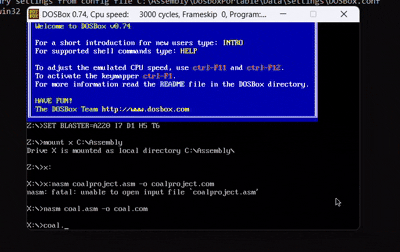

# ping_assembly

This is a classic Pong game implementation written in x86 assembly language for the DOS environment. The game features two paddles controlled by players, a bouncing ball, and a scoring system.

---

## 🎮 Game Description

### 🕹️ Gameplay
- **Player A** controls the left paddle using the **←** and **→** arrow keys.  
- **Player B** controls the right paddle using the **S** (left) and **D** (right) keys.  
- The ball bounces between paddles and walls.  
- Missing the ball lets the opponent score.  
- First player to reach **5 points** wins the game.

---

## 🛠️ Technical Details
- Uses **BIOS interrupts** for keyboard and timer functionality.
- Direct video memory manipulation at `0xB800` for rendering.
- Custom **keyboard (INT 09h)** and **timer (INT 08h)** interrupt handlers.
- Clean screen refresh, score tracking, and winner display logic.

---

## 💾 Memory Usage
- `paddleA`, `paddleB` — Paddle positions  
- `starpos`, `row`, `col` — Ball position  
- `pflag`, `dirflag` — Game state  
- `scoreA`, `scoreB` — Player scores  
- `oldkb`, `oldisr` — Original interrupt vectors (to restore after game ends)

---

## 🧱 Visual Elements
- Paddles: White vertical bars (20 characters wide)  
- Ball: Asterisk `*` with color change  
- Scores: Displayed at the bottom  
- Winner: Animated winner announcement at game end

---

## ⚙️ Installation Steps


### 1. Clone the repository
   ```bash
   git clone https://github.com/RanaAbdulHannan/ping_assembly.git
   cd ping_assembly
```
### 2. Assemble the Code Using NASM on Dosbox
```bash
nasm coal.asm -o coal.com
```
### 3.Run It 
```bash
coal.com
```


## 🕹️ Controls

- Player A: Arrow keys (←, →)
- Player B: S (left), D (right)

## 🏁 Scoring and Termination

- Player scores if opponent misses the ball.
- First to 5 points wins.
## Gameplay Demo 



## 👥 Contributors

- [Muhammad Zaigham Asif](https://github.com/MuhammadZaighamAsif)
- [Abdul Hannan](https://github.com/RanaAbdulHannan)

> **Institution**: FAST NUCES Lahore  
> **Course**: Computer Organization & Assembly Language, Fall 2024

